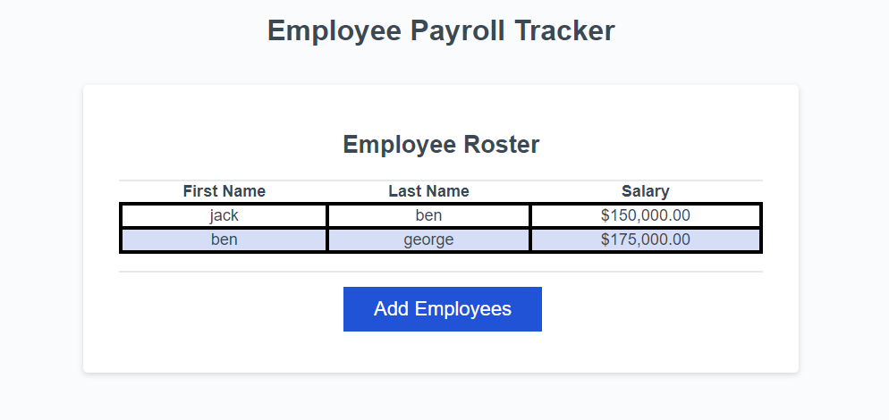

# Employee-Payroll-Tracker

A site to help keep track of the company's pay roll
Here are two Screenshots

this one shows that the site clearly shows the last names in alphabetical order as well as shows the first and the salary

this photo shows that it logs a random employee and congradulates them for winning as well as stating the average salary.
below is a link to the deployed page
https://amartin02.github.io/Employee-Payroll-Tracker/
